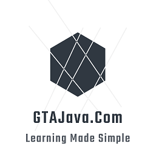

# GTAJavaCloud
Playground For cloud native applications  
Look at [GTAJava.com](https://gtajava.com) for complete documentation on types of sample applications and live deployment on various cloud providers. Will be comparing these applications across multiple cloud providers.

###Building

<ul><li>Each subproject has a pom file so that it can be build and deployed separately 
<li>Can be built with Maven ( you need maven and jdk)
<li>Has separate profile settings for building for GCP/Alibaba
</ul>

###Applications
<ul><li>
Serverless Application - This is a multitenant applicaiton which uses multiple cloud providers scaling capablities to search for matching jobs from different sources

```
mvn clean install spring-boot:repackage
```

After the build check if the jar is working by 

```
java -jar serverless-1.0-SNAPSHOT.jar
```

Then dockerize the application

```
$ docker login
<enter user name and password for Docker Hub Repository>

$ docker tag serverless {docker-hub-username}/{default-repo-folder-name}:serverless

$ docker push {docker-hub-username}/{default-repo-folder-name}:serverless
```

If you want to directly deploy the image you can find it here 

https://hub.docker.com/repository/docker/vishalmysore/serverless
</li>
<li>
 Cloud Scraping Application - Ansynchronous processing using Lambda-SQS or GCP Serverless-PubSub
<li>
Data processing - AWS S3 + GCP Storage
</ul>


###InfraStructure As Code
<ul><li> AWS CDK
<li> GCP Cloud Deploy
<li> Terraform


