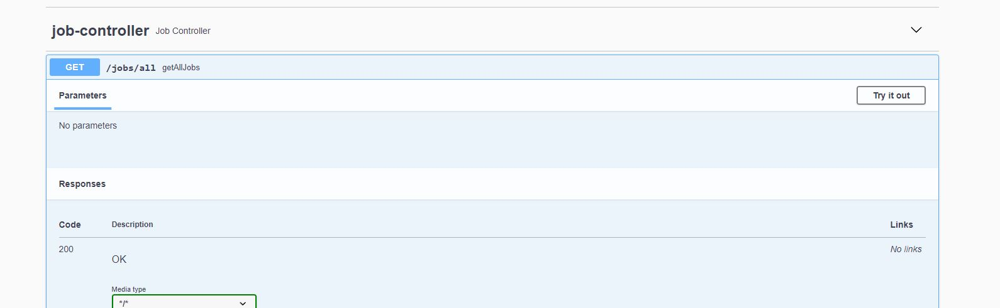
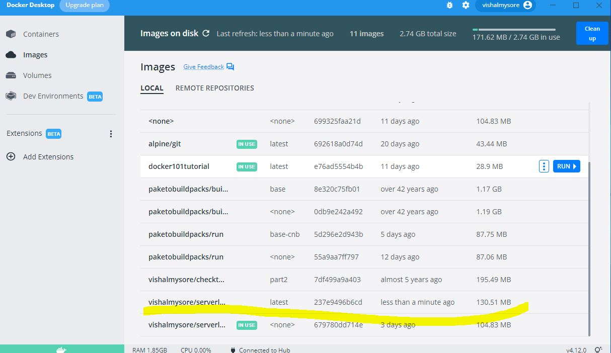
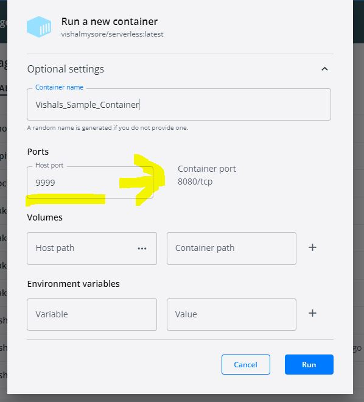

# Serverless Deployment

This application can be deployed on GCP/AWS/Azure or Heroku

Build the spring boot application

```
mvn clean install spring-boot:repackage
```

run the application

```
java -jar target\serverless-1.0-SNAPSHOT.jar
```

Connect to http://localhost:8080/swagger-ui and you should be able to see 




Try out the rest call and then STOP the service .

Now we will build the docker image

```
docker build -t vishalmysore/serverless .
```

If you have docker desktop you should be able to see it on 




Start the container by clicking the RUN button on docker desktop , you should be able to see this screen



Note that we are mapping the port 9999 to containers port 8080, once the service starts we should be able to connect to

http://localhost:9999/swagger-ui/

and see the same service running

Now you can push the image to your dockerhub

```
docker push vishalmysore/serverless:latest
```


